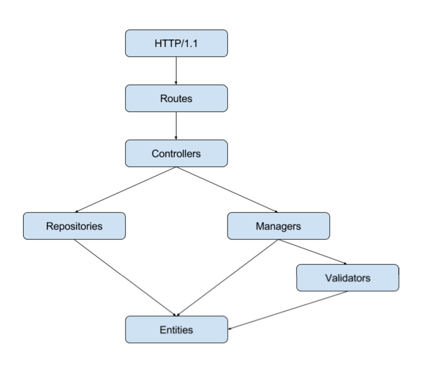

# Tutorial Laravel

## Nuevo proyecto

Comenzamos generando un nuevo proyecto

```
laravel new tutorial-laravel
```

Una vez se genere la copia de Laravel, se puede iniciar el servidor de desarrollo

```
cd tutorial-laravel
php artisan serve
```

```
Laravel development server started on http://localhost:8000/
```

El archivo .env sirve para configuraciones de la aplicación como conexión a base de datos

```
DB_HOST=127.0.0.1
DB_DATABASE=homestead
DB_USERNAME=homestead
DB_PASSWORD=secret
```

## Rutas

Las rutas se definen desde app/Http/routes.php

Una ruta se puede definir de varias maneras

```
Route::get('/', function () {
    return view('welcome');
});
```

```
Route::get('/', function () {
    return "<h1>Welcome</h1>"
});
```

```
Route::get('/', "HomeController@index");
```

## Controladores

Los controladores se encuentran por default en: app/Http/Controllers

Se puede generar desde consola:

```
php artisan make:controller HomeController
```

app/Http/Controllers/HomeController.php

```
namespace App\Http\Controllers;

use Illuminate\Http\Request;

use App\Http\Requests;
use App\Http\Controllers\Controller;

class HomeController extends Controller
{
    //
}
```

También se pueden generar rutas y controladores preparados para un CRUD

app/Http/routes.php

```
Route::resource('teams' , 'TeamController');
```

Esto genera las siguientes rutas:

```
+--------+-----------+--------------------+---------------+---------------------------------------------+------------+
| Domain | Method    | URI                | Name          | Action                                      | Middleware |
+--------+-----------+--------------------+---------------+---------------------------------------------+------------+
|        | GET|HEAD  | teams              | teams.index   | App\Http\Controllers\TeamController@index   |            |
|        | POST      | teams              | teams.store   | App\Http\Controllers\TeamController@store   |            |
|        | GET|HEAD  | teams/create       | teams.create  | App\Http\Controllers\TeamController@create  |            |
|        | DELETE    | teams/{teams}      | teams.destroy | App\Http\Controllers\TeamController@destroy |            |
|        | PUT|PATCH | teams/{teams}      | teams.update  | App\Http\Controllers\TeamController@update  |            |
|        | GET|HEAD  | teams/{teams}      | teams.show    | App\Http\Controllers\TeamController@show    |            |
|        | GET|HEAD  | teams/{teams}/edit | teams.edit    | App\Http\Controllers\TeamController@edit    |            |
+--------+-----------+--------------------+---------------+---------------------------------------------+------------+
```
Desde consola se puede generar el controlador con los metodos necesarios

```
php artisan make:controller TeamController --resource
```

app/Http/Controllers/TeamController.php

```
namespace App\Http\Controllers;

use Illuminate\Http\Request;

use App\Http\Requests;
use App\Http\Controllers\Controller;

class TeamController extends Controller
{
    /**
     * Display a listing of the resource.
     *
     * @return \Illuminate\Http\Response
     */
    public function index()
    {
        //
    }

    /**
     * Show the form for creating a new resource.
     *
     * @return \Illuminate\Http\Response
     */
    public function create()
    {
        //
    }

    /**
     * Store a newly created resource in storage.
     *
     * @param  \Illuminate\Http\Request  $request
     * @return \Illuminate\Http\Response
     */
    public function store(Request $request)
    {
        //
    }

    /**
     * Display the specified resource.
     *
     * @param  int  $id
     * @return \Illuminate\Http\Response
     */
    public function show($id)
    {
        //
    }

    /**
     * Show the form for editing the specified resource.
     *
     * @param  int  $id
     * @return \Illuminate\Http\Response
     */
    public function edit($id)
    {
        //
    }

    /**
     * Update the specified resource in storage.
     *
     * @param  \Illuminate\Http\Request  $request
     * @param  int  $id
     * @return \Illuminate\Http\Response
     */
    public function update(Request $request, $id)
    {
        //
    }

    /**
     * Remove the specified resource from storage.
     *
     * @param  int  $id
     * @return \Illuminate\Http\Response
     */
    public function destroy($id)
    {
        //
    }
}
```

## Entidades y migraciones

Se pueden crear entidades junto con su migración desde consola

```
php artisan make:model Entities/Team -m
php artisan make:model Entities/Member -m
```

Respuesta

```
Model created successfully.
Created Migration: 2016_02_18_203714_create_teams_table
Model created successfully.
Created Migration: 2016_02_18_204225_create_members_table
```

app/Entities/Team.php

```
namespace App\Entities;

use Illuminate\Database\Eloquent\Model;

class Team extends Model
{
    //
}
```

app/Entities/Member.php

```
namespace App\Entities;

use Illuminate\Database\Eloquent\Model;

class Member extends Model
{
    //
}
```

database/migrations/2016_02_18_203714_create_teams_table.php

```
use Illuminate\Database\Schema\Blueprint;
use Illuminate\Database\Migrations\Migration;

class CreateTeamsTable extends Migration
{
    /**
     * Run the migrations.
     *
     * @return void
     */
    public function up()
    {
        Schema::create('teams', function (Blueprint $table) {
            $table->increments('id');
            $table->timestamps();
        });
    }

    /**
     * Reverse the migrations.
     *
     * @return void
     */
    public function down()
    {
        Schema::drop('teams');
    }
}
```

database/migrations/2016_02_18_204225_create_members_table.php

```
use Illuminate\Database\Schema\Blueprint;
use Illuminate\Database\Migrations\Migration;

class CreateMembersTable extends Migration
{
    /**
     * Run the migrations.
     *
     * @return void
     */
    public function up()
    {
        Schema::create('teams', function (Blueprint $table) {
            $table->increments('id');
            $table->timestamps();
        });
    }

    /**
     * Reverse the migrations.
     *
     * @return void
     */
    public function down()
    {
        Schema::drop('members');
    }
}
```

Laravel proporciona la Clase Blueprint para generar los campos dentro de las migraciones dentro del metodo up [https://laravel.com/docs/5.2/migrations](https://laravel.com/docs/5.2/migrations)

database/migrations/2016_02_18_203714_create_teams_table.php

```
$table->string('name' , 255)->nullable();
```

database/migrations/2016_02_18_204225_create_members_table.php

```
$table->string('name', 255)->nullable(false);
$table->string('email', 255)->nullable(false);
$table->string('image', 255)->nullable();
$table->integer('team_id')->unsigned()->nullable();
$table->foreign('team_id')
    ->references('id')
    ->on('teams')
    ->onUpdate('cascade')
    ->onDelete('set null');
```

Las migraciones se ejecutan desde consola

```
php artisan migrate
```

Respuesta

```
Migration table created successfully.
Migrated: 2014_10_12_000000_create_users_table
Migrated: 2014_10_12_100000_create_password_resets_table
Migrated: 2016_02_18_203714_create_teams_table
Migrated: 2016_02_18_204225_create_members_table
```

Las clases de Modelo requieren una propiedad llamada fillable, que es un array que contiene los campos que se van a poder asignar una valor desde la aplicación (setter)


app/Entities/Team.php

```
protected $fillable = [
    'name',
];
```

app/Entities/Member.php


```
protected $fillable = [
    'name', 'email' , 'team_id' , 'image'
];
```

## Relaciones

Las relaciones se definen dentro de la clase de modelo de manera sencilla

app/Entities/Team.php

```
public function members()
{
    return $this->hasMany(Member::class);
}
```

app/Entities/Member.php

```
public function team()
{
    return $this->belongsTo(Team::class);
}
```

## Seeders

Los seeders se utilizan para poblar las tablas con datos de prueba. Se pueden generar desde consola

```
php artisan make:seeder TeamsTableSeeder
```

Respuesta

```
Seeder created successfully.
```

```
php artisan make:seeder MembersTableSeeder
```

Respuesta

```
Seeder created successfully.
```

database/seeds/TeamsTableSeeder.php

```
use Illuminate\Database\Seeder;

class TeamsTableSeeder extends Seeder
{
    /**
     * Run the database seeds.
     *
     * @return void
     */
    public function run()
    {
        //
    }
}
```

database/seeds/MembersTableSeeder.php

```
use Illuminate\Database\Seeder;

class MembersTableSeeder extends Seeder
{
    /**
     * Run the database seeds.
     *
     * @return void
     */
    public function run()
    {
        //
    }
}
```

Agregamos 5 equipos desde el metodo run del TeamsTableSeeder

```
public function run()
{
    $teams = [
        'Web',
        'IOS',
        'Android',
        'QA',
        'Windows Phone'
    ];

    foreach($teams as $team)
    {
        App\Entities\Team::create([
            'name' => $team
        ]);
    }
}
```

Ejecutamos el seeder desde consola

```
php artisan db:seed --class=TeamsTableSeeder
```

#### Model Factory

Los Model Factory se utilizan para generar registros Faker desde los seeders

Implementamos un Model Factory para la entidad de Member

database/factories/ModelFactory.php


```
$factory->define(App\Entities\Member::class, function (Faker\Generator $faker) {

    $team = App\Entities\Team::all()->random(1);

    return [
        'name' => $faker->name,
        'email' => $faker->safeEmail,
        'team_id' => $team->id,
        'image' => str_random(12).'.jpg'
    ];
});
```

Lo integramos en el seeder

database/seeds/MembersTableSeeder.php

```
public function run()
{
    factory(App\Entities\Member::class, 20)->create();
}
```

Ahora, podemos ejecutar ese seeder cada vez que querramos generar registros de prueba

```
php artisan db:seed --class=MembersTableSeeder
php artisan db:seed --class=MembersTableSeeder
php artisan db:seed --class=MembersTableSeeder
``` 

## Campos virtuales

Se pueden agregar campos dinamicanete al modelo que no existen en la base de datos.

Solo se definen los campos a agregar dentro del arreglo $appends de la clase de modelo y se implementa la función que va a devolver el valor de ese campo.

Crearemos un campo llamado full_image que contendra la url completa de la imagen de un miembro de un equipo.

app/Entities/Member.php

``` 
protected $appends = ['full_image'];

public function getFullImageAttribute()
{
    if(empty($this->image))
    {
        return '';
    }

    return asset('members/'.$this->image);
}
``` 

## Inyección de dependencias

Gracias al Service Container de Laravel, podemos implementar inyección de dependencias de manera sencilla

Inyectaremos la entidad Team dentro de su controlador y la asociaremos a una propiedad del controlador.

app/Http/Controllers/TeamController.php

```
use App\Entities\Team as Entity;

class TeamController extends Controller
{
    /**
     * @var Entity
     */
    protected $entity;

    public function __construct(Entity $Entity)
    {
        $this->entity = $Entity;
    }

    /**
     * Display a listing of the resource.
     *
     * @return \Illuminate\Http\Response
     */
    public function index()
    {
        $resources = $this->entity->all();
        //$resources = $this->entity->with('members')->get();

        return response()->json($resources);
    }
``` 

## Arquitectura de capas

Gracias a la inyección de dependencias y a la flexibilidad y desacoplamiento que ofrece Laravel, es muy sencillo implementar un patrón de diseño como la arquitectura en capas, de la siguiente forma:



En este ejemplo, crearemos un CRUD de la entidad TEAM a manera de API RESTful.

Para esto, refactorizaremos un poco el código ya generado.

Creaeremos una carpeta que contendra todas las capas a excepcion de la capa de controladores.

``` 
mkdir app/Gigigo
``` 

Dentro de esa carpeta, copiamos la carpeta de Entities que ya teniamos creada y cambiaremos el nombre de las clases y archivos:

Team.php por TeamEntity.php
Member.php por MemberEntity.php

También debemos cambiar el namespace de las clases:

De App\Entities por App\Gigigo\Entities

#### Entities

No tiene ninguna dependencia y extiende directamente de la clase Model de Eloquent

app/Gigigo/Entities/TeamEntity.php

``` 
namespace App\Gigigo\Entities;

use Illuminate\Database\Eloquent\Model;

class TeamEntity extends Model
{
    protected $table = 'teams';

    /**
     * The attributes that are mass assignable.
     *
     * @var array
     */
    protected $fillable = [
        'name',
    ];

    /**
     * The attributes excluded from the model's JSON form.
     *
     * @var array
     */
    protected $hidden = [
        'created_at', 'updated_at',
    ];

    protected $appends = [];

    public function members()
    {
        return $this->hasMany(MemberEntity::class , 'team_id');
    }

}
```

app/Gigigo/Entities/MemberEntity.php

``` 
namespace App\Gigigo\Entities;

use Illuminate\Database\Eloquent\Model;

class MemberEntity extends Model
{
    protected $table = 'members';
    /**
     * The attributes that are mass assignable.
     *
     * @var array
     */
    protected $fillable = [
        'name', 'email' , 'team_id' , 'image'
    ];

    /**
     * The attributes excluded from the model's JSON form.
     *
     * @var array
     */
    protected $hidden = [
        'created_at', 'updated_at',
    ];

    protected $appends = ['full_image'];

    public function team()
    {
        return $this->belongsTo(TeamEntity::class , 'team_id');
    }

    public function getFullImageAttribute()
    {
        if(empty($this->image))
        {
            return '';
        }

        return asset('members/'.$this->image);
    }
}
``` 

#### Validators

Se utiliza para validar una instancia de entidad antes de ser guardada o actualizada en base de datos.

Tiene como dependencia a una Entidad

app/Gigigo/Validators/TeamValidator.php


``` 
namespace App\Gigigo\Validators;

use App\Gigigo\Entities\TeamEntity as Entity;
use Illuminate\Support\Facades\Validator;

class TeamValidator {

    /**
     * @array rules
     */
    protected $rules = [
        'name' => 'required|unique:teams,name'
    ];

    /**
     * @object Entity
     */
    protected $entity;

    /**
     * @object
     */
    protected $errors;

    /**
     * @param Entity $Entity
     */
    public function __construct(Entity $Entity)
    {
        $this->entity = $Entity;
    }
    /**
     * @return mixed
     */
    public function getRules()
    {
        return $this->rules;
    }
    /**
     * @return mixed
     */
    public function getCreateRules()
    {
        return $this->getRules();
    }
    /**
     * @return mixed
     */
    public function getUpdateRules()
    {
        $rules = $this->getRules();

        $rules['name'] .= ','.$this->entity->id;

        return $rules;
    }
    /**
     * @return mixed
     */
    public function getErrors()
    {

        return $this->errors;
    }
    /**
     * @param $data
     * @return bool
     */
    public function isValid($data)
    {
        $this->data = $data;

        if ($this->entity->exists) {
            $rules = $this->getUpdateRules();
        } else {
            $rules = $this->getCreateRules();
        }

        $validation =  Validator::make($data, $rules);

        if ($validation->passes()) return true;

        $this->errors = $validation->messages();

        return false;
    }
    /**
     * @param Entity $Entity
     */
    public function setEntity(Entity $Entity)
    {
        $this->entity = $Entity;
    }

}
``` 

#### Managers

Se encarga de todas las operaciones de escritura o procesamiento requeridos por la aplicación, por ejemplo:

* Guardar, editar, eliminar un registro
* Enviar un correo electronico
* Ejecutar algun comando o cronjob

Pueden existir tantos managers como se requiera y no solamente uno por entidad.

En este ejemplo, se utiliza un manager para guardar, editar y eliminar un registro en base de datos. Este manager tiene como dependencia un Validador y una Entidad


app/Gigigo/Managers/TeamManager.php

``` 
namespace App\Gigigo\Managers;

use App\Gigigo\Entities\TeamEntity as Entity;
use App\Gigigo\Validators\TeamValidator as Validator;

class TeamManager {

    /**
     * @var
     */
    protected $data;

    /**
     * @var Entity
     */
    protected $entity;

    /**
     * @var Validator
     */
    protected $validator;

    /**
     * @param Entity $Entity
     * @param Validator $Validator
     */
    public function __construct(Entity $Entity, Validator $Validator)
    {
        $this->entity = $Entity;
        $this->validator = $Validator;
    }

    /**
     * @return \Illuminate\Database\Eloquent\Collection|static[]
     */
    public function save(array $data)
    {
        $this->data = $data;
        $this->prepareData();

        $isValid = $this->validator->isValid($this->data);

        if ($isValid) {

            $this->entity->fill($this->data);
            $this->entity->save();
            return $this->entity;

        } else {
            return $this->validator->getErrors();
        }
    }

    public function update(array $data)
    {
        $this->data = $data;
        $this->prepareData();

        $this->validator->setEntity($this->entity);

        $isValid = $this->validator->isValid($this->data);

        if ($isValid) {

            $fillable = $this->entity->getFillable();
            $data = $this->data;

            foreach ($data as $k => $v) {
                if (in_array($k, $fillable)) {
                    $this->entity->$k = $v;
                }
            }

            $this->entity->update();
            return $this->entity;

        } else {
            return $this->validator->getErrors();
        }
    }

    public function delete()
    {
        if($this->entity->exists)
        {
            return $this->entity->delete();
        }
        else
        {
            return false;
        }
    }
    /**
     *
     */
    public function prepareData()
    {
        $data = $this->data;

        /*TO DO*/

        $this->data = $data;
    }
    /**
     * @param Entity $Entity
     */
    public function setEntity(Entity $Entity)
    {
        $this->entity = $Entity;
    }
}
```

#### Repositories

Se encarga de todas las operaciones de lectura requeridas por la aplicación.

Tiene como dependencia una Entidad

app/Gigigo/Repositories/TeamRepository.php

```
namespace App\Gigigo\Repositories;

use App\Gigigo\Entities\TeamEntity as Entity;

class TeamRepository {

    protected $entity;

    public function __construct(Entity $Entity)
    {
        $this->entity = $Entity;
    }

    public function all()
    {
        return $this->entity->get();
    }

    public function findById($id)
    {
        return $this->entity->with('members')->find($id);
    }

}
``` 

#### Controllers

Puede tener como dependencia uno o varios Repositorios y Manejadores.

app/Http/Controllers/TeamController.php

``` 
namespace App\Http\Controllers;

use Illuminate\Http\Request;

use App\Http\Requests;
use App\Http\Controllers\Controller;

use App\Gigigo\Repositories\TeamRepository as Repository;
use App\Gigigo\Managers\TeamManager as Manager;
use App\Gigigo\Entities\TeamEntity as Entity;
use Illuminate\Support\MessageBag;

class TeamController extends Controller
{
    /**
     * @var Repository
     */
    protected $repository;
    /**
     * @var Manager
     */
    protected $manager;
    /**
     * @param Repository $Repository
     * @param Manager $Manager
     */
    public function __construct(Repository $Repository, Manager $Manager)
    {
        $this->repository = $Repository;
        $this->manager = $Manager;
    }

    /**
     * Display a listing of the resource.
     *
     * @return \Illuminate\Http\Response
     */
    public function index()
    {
        $resources = $this->repository->all();
        return response()->json($resources);

    }

    /**
     * Store a newly created resource in storage.
     *
     * @param  \Illuminate\Http\Request  $request
     * @return \Illuminate\Http\Response
     */
    public function store(Request $request)
    {
        $data = $request->all();

        $response = $this->manager->save($data);
        if ($response instanceof Entity) {

            return response()->json($response, 200);

        } else if ($response instanceof MessageBag) {

            return response()->json($response, 400);

        }

        return response()->json(['error' => 'Server error. Try Again'], 500);

    }

    /**
     * Display the specified resource.
     *
     * @param  int  $id
     * @return \Illuminate\Http\Response
     */
    public function show($id)
    {
        $resource = $this->repository->findById($id);

        if (!$resource) {
            return response()->json(['error' => 'Entity not found'], 404);
        }

        return response()->json($resource);
    }

    /**
     * Update the specified resource in storage.
     *
     * @param  \Illuminate\Http\Request  $request
     * @param  int  $id
     * @return \Illuminate\Http\Response
     */
    public function update(Request $request, $id)
    {
        $resource = $this->repository->findById($id);

        if (!$resource) {
            return response()->json(['error' => 'Entity not found'], 404);
        }

        $data = $request->all();

        $this->manager->setEntity($resource);

        $response = $this->manager->update($data);

        if ($response instanceof Entity) {

            return response()->json($response, 200);

        } else if ($response instanceof MessageBag) {

            return response()->json($response, 400);

        }

        return response()->json(['error' => 'Server error. Try Again'], 500);
    }

    /**
     * Remove the specified resource from storage.
     *
     * @param  int  $id
     * @return \Illuminate\Http\Response
     */
    public function destroy($id)
    {
        $resource = $this->repository->findById($id);

        if(!$resource)
        {
            return response()->json(['error' => 'Entity not found'] , 404);
        }

        $this->manager->setEntity($resource);

        $response = $this->manager->delete();

        if($response){

            return response()->json(['success' => 'Entity deleted'], 200);

        }

        return response()->json(['error' => 'Server error. Try Again' ],500);
    }
}
``` 

El código fuente de este tutorial esta disponible, paso a paso, en Github, en:

[https://github.com/iramgutierrez/tutorial-laravel](https://github.com/iramgutierrez/tutorial-laravel)


